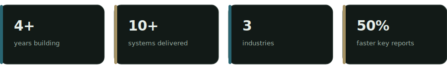
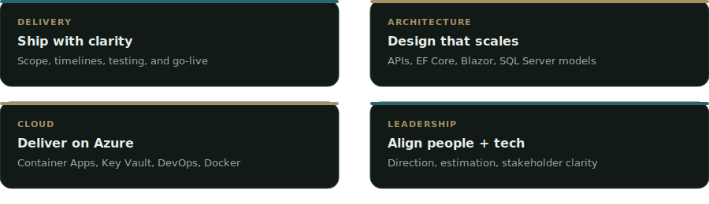

<div align="center">
  
  <br/><br/>
  

  <p>
    <a href="https://efrainarayapt.online"></a>
    <a href="https://linkedin.com/in/earayaf"></a>
    <a href="mailto:earaya.f01@gmail.com"></a>
    <a href="https://wa.me/50687623735"></a>
  </p>

  
</div>

---

## About

Mid / Semi-Sr Tech Lead with **4+ years** shipping enterprise systems.  
I work where **code meets business**: architecture, estimation, CI/CD, and hands-on delivery.

> Clean architecture. Honest estimates. Software that holds up in production — not just in demos.

<p align="center">
  
</p>

---

## How I work

<p align="center">
  
</p>

<p align="center">
  
</p>

---

## Stack

<p align="center">
  
</p>

---

## Things I've shipped

Projects grouped by problem type — technologies first, outcomes second.

### Platforms & APIs
Enterprise web platforms with clean architecture, REST APIs, and Blazor UIs.

`C#` `ASP.NET Core` `EF Core` `Blazor` `SQL Server` `Azure`

- Multi-module business platforms delivered end-to-end
- Domain models and APIs designed for real production load

### Cloud & delivery
CI/CD and cloud packaging so releases are boring (in a good way).

`Azure` `Azure DevOps` `Docker` `Container Apps` `Key Vault`

- Pipelines for build → test → deploy
- Environment separation and secret hygiene

### Data, BI & reporting
Dashboards and SQL reporting that cut time-to-decision.

`SQL Server` `T-SQL` `Oracle` `PostgreSQL` `SAP HANA` `KPIs`

- Expenses & purchasing analytics with dynamic filters
- Operational reporting with ~**50%** less time on key reports
- Models that handled **+50%** data volume without degrading

### Operations workflows
Digital flows that replace paper and chase emails.

`Workflows` `.NET` `SQL` `Approvals` `ERP integration`

- Warehouse release requests: create → approve → dispatch
- Fuel control + asset maintenance with usage-based work orders
- Payroll processing with time-clock import and ERP payments

### Mobile on the floor
Android tools for warehouse and production-line reality.

`Kotlin` `Java` `Android` `SQL Server` `Oracle`

- Warehouse inventory with barcode-oriented capture
- Production quality control (team setup, defect types, counters)
- ~**60%** fewer data-entry errors on quality capture

---

## Snapshot

```text
  Platforms ████████████████░░░░  .NET / Blazor / APIs
  Data      ██████████████████░░  SQL Server · Oracle · PG
  Cloud     ███████████████░░░░░  Azure · CI/CD · Docker
  Mobile    ████████████░░░░░░░░  Kotlin / Android
  Workflows ████████████████░░░░  Ops · Payroll · Fuel
```

---

## Let's build something solid

Have a system to improve, a process to automate, or a product to ship?

<p align="center">
  <a href="https://efrainarayapt.online"></a>
  <a href="mailto:earaya.f01@gmail.com"></a>
  <a href="https://linkedin.com/in/earayaf"></a>
</p>

<div align="center">
  <sub>Costa Rica · Open to impactful engineering & tech leadership conversations</sub>
</div>
